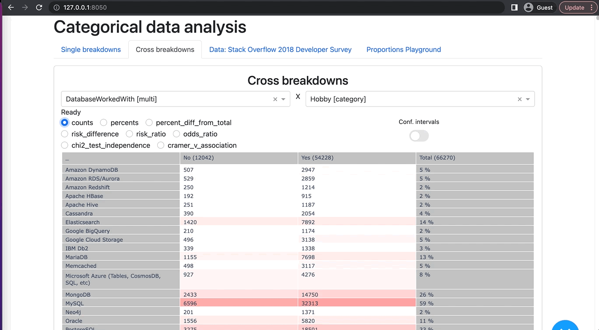

# Multi-choice contingency tables

Simple dashboard built with [Dash](https://dash.plotly.com/) to analyze contingency tables for categorical data.
Allows to see significance and effect size of association between categorical variables.
Especially useful for analyzing survey results.
A special feature of our approach is using of **multi-choice cross-breakdowns**.
Compared to standard contingency tables, where each variable value is exclusive,
we allow multi-value variables, and display them on the same cross-table.
As an example of such variables, you can imagine surveys with multi-choice questions.
Standard approach to analyze such questions is to treat each answer option as separate binary variable.

Our approach to display all aswers on the same contingecy table eleminates the need to create multiple indicator variables, 
allows more compact representation without big loss in informativeness.  


## 🔥 Features

Cross-breakdown currently displays the following statistics:

* frequences
* percents - with conf. intervals (for infinite population)
* risk difference, risk ratio - with conf.intervals
* odds ratio - with conf. intervals
* p-value for $\chi^2$ test of independence
* Cramer's V association coefficient




UI also provides some visualizations of how confidence intervals behave depending on parameters.


#  ⚡️ Run locally
Assuming you have python 3.11 and poetry installed:
* before `git clone ...`, [git-lfs](https://git-lfs.com/) should be installed to fetch example dataset.
* `poetry shell` - creates virtual environment and activates it
* `poetry install` - isntalles dependencies
* `python -m multi_choice_contingency_tables.app` - Dash dev server

# 🛠 Data
Example data is taken from this [kaggle dataset](https://www.kaggle.com/datasets/stackoverflow/stack-overflow-2018-developer-survey?resource=download&select=survey_results_schema.csv)

But you can put your own dataset in the data directory.
Requirements:
* it should be a pickled pandas dataframe (with `.pickle` file extension)
* multi-choice variables should be stored as lists/tuples in columnd with dtype "object". E.g., question should be column name, each cell contain a list of strings - answer options selected by respondent


# Troubleshooting
* if you don't have git-lfs installed, just download data with the following command:
```bash
wget https://github.com/mihasK/multi-choice_contingency_tables/raw/main/multi_choice_contingency_tables/data/Stack%20Overflow%202018%20Developer%20Survey.pickle -O "multi_choice_contingency_tables/data/Stack Overflow 2018 Developer Survey.pickle"
```
